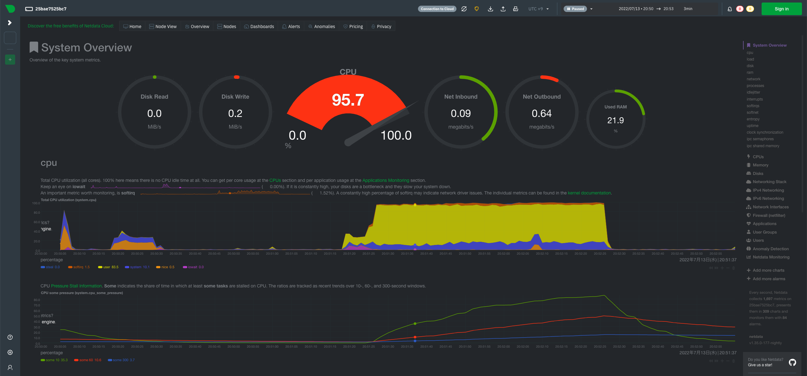

## netdata
### 概要
OSのパフォーマンス指標を Web UI でわかりやすく表示してくれるツール

### インストール方法
1. docker をインストールする

2. 以下のコマンドでインストール＆起動する
```
docker run -d --name=netdata \
  -p 19999:19999 \
  -v /etc/passwd:/host/etc/passwd:ro \
  -v /etc/group:/host/etc/group:ro \
  -v /proc:/host/proc:ro \
  -v /sys:/host/sys:ro \
  -v /var/run/docker.sock:/var/run/docker.sock:ro \
  --cap-add SYS_PTRACE \
  --security-opt apparmor=unconfined \
  netdata/netdata
```

### 使い方
1. ブラウザで `http://<server-ip>:19999/` にアクセスする


2. 画面右上に `(Playing/Paused) 2022/07/13・21:02 -> 21:11 9min` などと書いてあるところがあるが、ここで解析対象の時間を設定することが可能
    - `Playing` のときは、リアルタイム解析。解析する直近の時間の長さを指定できる（直近10分解析、など）
    - `Paused` のときは、非リアルタイム解析。解析する開始時刻と終了時刻を指定できる

3. 画面上に、`import` / `export` ボタンがあり、解析結果を 読み込み / 保存 できる
    - 保存する際に、データ点の間隔を指定できる（3 seconds per point など）

4. 各指標の説明は英語で説明が書いてあるのでそこを読むこと。ISUCONで出てきそうなのは
    1. cpu/load
        - [loadについてはwikipediaがわかりやすい](https://en.wikipedia.org/wiki/Load_(computing))
        - isuconのwebappなどは user プロセスとして動くので、cpu/user が大きい -> CPU負荷が高い、となる
        - CPUがフル稼働（100%）のときは、loadを見る。待たされているプロセスの数がわかるので、どのくらい処理が間に合っていないのかがはっきりわかる
    2. disk
        - 読み込みが多いか、書き込みが多いかが `in(reads)` / `out(writes)` を見るとわかる
        - これが上下に張り付いて定数だったら、ディスクがボトルネックになっている
    3. ram 
        - [IT Mediaの記事がわかりやすい](https://atmarkit.itmedia.co.jp/ait/articles/0810/01/news134_2.html)
        - free: 空きメモリ
        - used: 現在（明示的に）使用しているメモリ
        - cached: ファイル本体のキャッシュを持っているメモリ
            - キャッシュの内容が最新（＝ディスクと同じ内容）のもの。これはその気になれば開放できるので free メモリとして扱うこともできる
            - キャッシュの内容が古くなっているもの
        - buffers: ファイルのメタデータのキャッシュ
    4. network
        - 張り付いていたら network bounded

### 備考・注意点・躓いた点
- 特になし。大まかに指標を読めるようになっておこう。

### 参考文献
- https://en.wikipedia.org/wiki/Load_(computing)
- https://atmarkit.itmedia.co.jp/ait/articles/0810/01/news134_2.html
