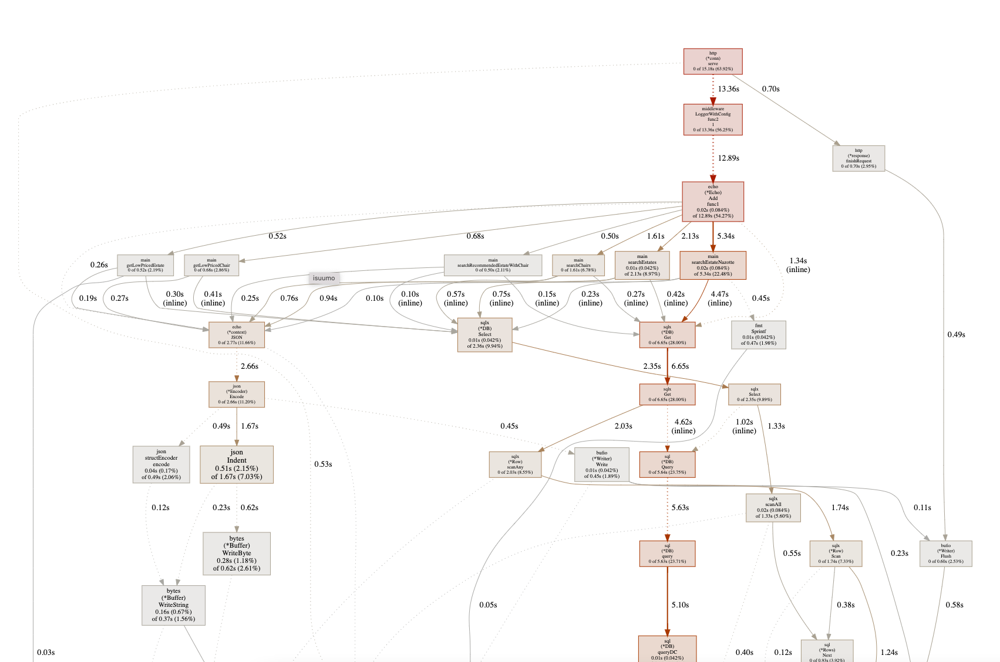
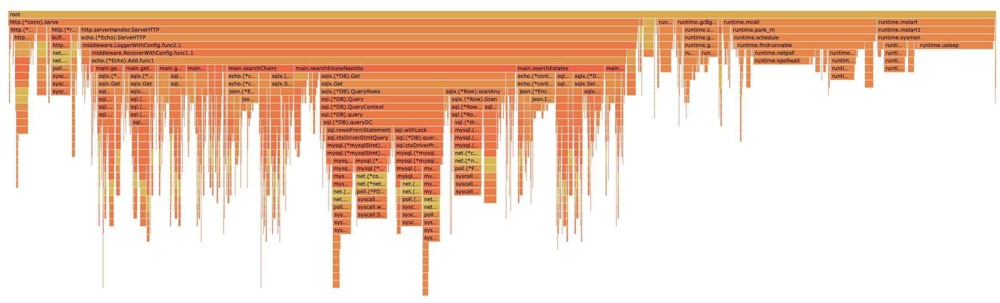

## pprof
### 概要
go アプリケーション向けのプロファイラ

### インストール方法
アプリケーションのソースコードを編集してpprof計測用のエンドポイントを仕込む。使っているWAFによって導入の仕方が微妙に異なるので注意

i. 標準goの場合
```go
import (
    "net"
    "net/http"
    _ "net/http/pprof" // 追加
)
```

ii. WAF に echo を使っている場合  
`github.com/sevenNt/echo-pprof` を使って設定するのが吉  
```go  
…
import (
    …
    "github.com/labstack/echo"
	"github.com/labstack/echo/middleware"
    "github.com/sevenNt/echo-pprof" // 追加
    …
)
…
func main() {
…
    e := echo.New()
    echopprof.Wrap(e) // 追加    
}
```  

iii. WAF に gorilla/mux を使っている場合    
    
```go
import (
    "github.com/gorilla/mux"
    "net"
    "net/http"
    "net/http/pprof" // 追加(importしているだけ)
)

func main() {
    r := mux.NewRouter()
    r.HandleFunc("/debug/pprof/", pprof.Index) // 追加
    r.HandleFunc("/debug/pprof/cmdline", pprof.Cmdline) // 追加
    r.HandleFunc("/debug/pprof/profile", pprof.Profile) // 追加
    r.HandleFunc("/debug/pprof/symbol", pprof.Symbol) // 追加
    r.HandleFunc("/debug/pprof/heap", pprof.Handler("heap").ServeHTTP) // 追加
    r.HandleFunc("/", hello())
    lin, err := net.Listen("tcp", ":8080")
    if err != nil {
        panic(err)
    }
    defer lin.Close()
    s := new(http.Server)
    s.Handler = r
    s.Serve(lin)
```


### 使い方

1. ベンチマークを実行し、すぐに計測コマンドを実行する
```
$ (ベンチマークコマンド)
$ go tool pprof -http="0.0.0.0:22222" http://localhost:1323/debug/pprof/profile?seconds=60
```
このコマンドを実行すると、60秒間の計測を行う。結果はファイル（`/home/isucon/pprof/pprof.isuumo.samples.cpu.001.pb.gz`）として保存される。

結果をコマンド等で確認することもできるが、`-http` オプションがついているので、結果表示用のwebサーバーを立ち上げてくれる。ISUCONではこちらで確認したほうが早そう。

2. 結果表示用のWebサーバーにアクセスする
```
http://<server-ip>:22222/
```

- graph

- framegraph


ISUCONではframegraphが使えそう

3. (オプション) 計測結果ファイルを指定して `go tool pprof` を実行すると、計測をスキップして解析だけしてくれる
```
$ go tool pprof -http="0.0.0.0:22222" /home/isucon/pprof/pprof.isuumo.samples.cpu.001.pb.gz
```

### 備考・注意点・躓いた点
- 使っているWAFによって導入の仕方が微妙に異なるので注意する
  - https://zenn.dev/muroon/articles/adf577f563c806
  - ページが上手くbindできていないと、Connection Refused や 404 Not Found が出る。
- 計測用エンドポイントにアクセスできない
  - 導入の仕方を間違えていませんか
  - apiサーバーのポートを指定していますか？ nginxのポートを指定してしまっていたりしませんか？
  - ファイアーウォールの設定は大丈夫ですか？　インスタンス内のものとクラウド（AWS）のものをチェック
- `-http`オプションで`:22222`を設定すると、インスタンス内部からしかアクセスできなくなるので注意
    - `sudo lsof -i :22222` で `localhost:22222` になっているか `0.0.0.0:22222` になっているかを確認しよう
    - 前者はローカルからのみ接続可能、後者は誰からもアクセス可能
 
### 参考文献
- https://zenn.dev/muroon/articles/adf577f563c806
- https://qiita.com/smith-30/items/7b3216073f3fe6abd740